#
**企业进存销系统**  
 
 
 
#
 **SSASS(Stocking Selling and                               	Storing System)**
 
 
 
#
体系结构设计文档Storing System)
 
 
 
 
 
###**学院：南京大学软件学院** 
###**成员：潘羽 谢寅鹏 熊以恒 肖云帆** 
###**完成日期：2017年10月18日** 

##目录

##更新历史

#1.引言

##&nbsp;&nbsp;&nbsp;&nbsp;1.1编制目的
&nbsp;&nbsp;&nbsp;&nbsp;本报表详细完成对企业进销存系统的概要设计，达到指导详细设计和开发的目的，同时实现和测试人员及用户的沟通。
  &nbsp;&nbsp;&nbsp;&nbsp; 本报告面向开发人员、测试人员及最终用户而编写，是了解系统的导航。
 
 
 
##&nbsp;&nbsp;&nbsp;&nbsp;1.2词汇表
<table>
	<tr>
		<th>词汇名称</th>
		<th>词汇含义</th>
		<th>备注</th>
	</tr>
	<tr>
		<th>ui</th>
		<th>表示某展示层</th>
		<th>&nbsp;&nbsp;&nbsp;&nbsp;&nbsp;&nbsp;&nbsp;&nbsp;&nbsp;&nbsp;&nbsp;&nbsp;&nbsp;&nbsp;&nbsp;&nbsp;</th>
	</tr>
	<tr>
		<th>bl</th>
		<th>表示某逻辑层</th>
		<th>&nbsp;&nbsp;&nbsp;&nbsp;&nbsp;&nbsp;&nbsp;&nbsp;&nbsp;&nbsp;&nbsp;&nbsp;&nbsp;&nbsp;&nbsp;&nbsp;</th>
	</tr>
	<tr>
		<th>data</th>
		<th>表示某数据层</th>
		<th>&nbsp;&nbsp;&nbsp;&nbsp;&nbsp;&nbsp;&nbsp;&nbsp;&nbsp;&nbsp;&nbsp;&nbsp;&nbsp;&nbsp;&nbsp;&nbsp;</th>
	</tr>
	<tr>
		<th>RMI</th>
		<th>表示远程方法调用</th>
		<th>&nbsp;&nbsp;&nbsp;&nbsp;&nbsp;&nbsp;&nbsp;&nbsp;&nbsp;&nbsp;&nbsp;&nbsp;&nbsp;&nbsp;&nbsp;&nbsp;</th>
	</tr>
</table>

##&nbsp;&nbsp;&nbsp;&nbsp;1.3参考资料
<ol>
	<li>IEEE std 1471-2000</li>
<li>丁二玉，刘钦.计算与软件工程（卷二）[M]机械工业出版2012：134—182
</li>
</ol>

 
 
 
#2.产品概述
&nbsp;&nbsp;&nbsp;&nbsp;参考企业进销存系统系统用例文档和企业进销存系统软件需求规格说明文档中对产品的概括描述。企业进销存系统主要是应用于减少挤压库存，增加销售额，提高财务人员工作效率，为经理的决策做支持，主要功能见用例图如下。

_用例图.png)

 
 
 
#3.逻辑视角
&nbsp;&nbsp;&nbsp;&nbsp;企业进销存系统中，选择了分层体系结构风格，将系统分为3层(展示层、业务逻辑层、数据层)能够很好地示意整个高层抽象。展示层包含GUI页面的实现，业务逻辑层包含业务逻辑处理的实现，数据层负责数据的持久化和访问。分层体系结构的逻辑视角和逻辑设计方案如图1和图2所示。
 
 
 

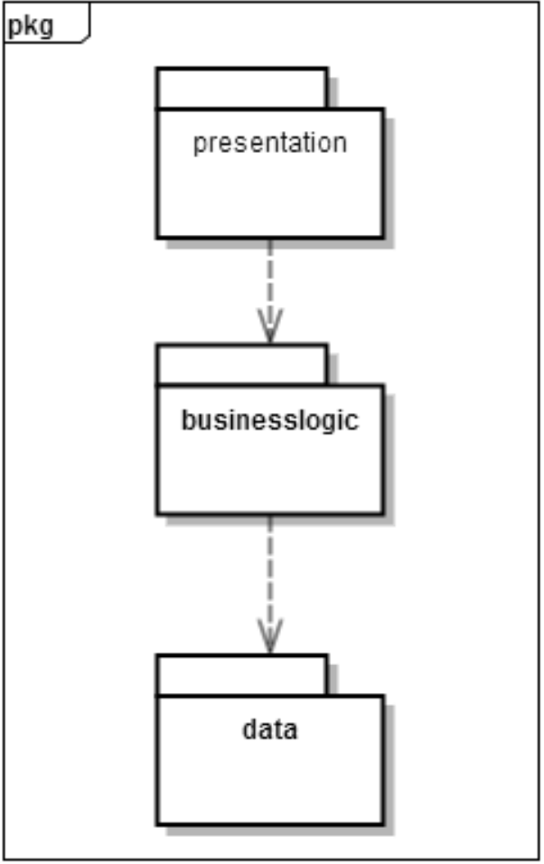
 &nbsp;&nbsp;&nbsp;&nbsp;图一 参照体系结构风格的包图表达逻辑视角
 
 
 

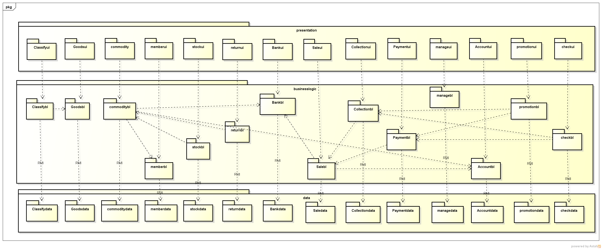
 &nbsp;&nbsp;&nbsp;&nbsp;图二 软件体系结构逻辑设计方案
 
 
 

#4.组合视角
 &nbsp;&nbsp;&nbsp;&nbsp;[软工2 166]与抽象的逻辑设计相比，实现物理设计要考虑更多的实现细节，这些细节有：
<ol>
	<li>presentation层与logic层被置于客户端，data层被置于服务器端，那么logic层的开发包不可能依赖于data层的开发包。使用RMI技术，将data层开发包分解为置于客户端的dataservice接口包和置于服务器端的data层开发包。这样一来，logic层开发包依赖于dataservice包，dataservice包和data层的开发包都依赖于RMI类库包。</li>
	<li>所有的data层开发包都需要进行数据持久化（例如读写数据库、读写文件等），所以它们会有一些重复代码，可以将重复代码独立为新的开发包，然后所有的data层开发包都依赖于databaseutility。datavaseutility会依赖于JDBC类库包。
</li>
	<li>所有的presentation层开发包都需要使用图形类型建立界面，都要依赖于图形界面类库包。
</li>
	<li>此外，presentation层实现时，由mainui包负责整个页面之间的跳转逻辑。其他各包负责各自页面自身的功能。
</li>
	<li>在分层风格的典型设计中，不希望高层直接依赖于低层，而是为低层建立接口包，实现依赖倒置原则，所以应该调整为：各presentation层开发包（调用）依赖于logic层接口包businesslogicservice包，logic层开发包也依赖于（实现了）logic层接口包businesslogicservice包。
</li>
	<li>在分层风格的典型设计中，presentation层与logic层之间、logic层与data层之间可能会传递复杂数据对象，那么相邻两层都需要使用数据对象声明，所以需要将数据对象声明独立为开发包（VO包和PO包）。
</li>
<li>在logic层中，初始化和业务逻辑层上下文的工作被分配到utility包中。
经过细节改进，最终建立的互联网酒店预订系统开发包设计如表4.1-1，其局部包图如图4.1-1和4.1-2所示：
</li>
</ol>

#4.1开发包图
<table>
	<tr>
		<th>开发(物理)包</th>
		<th>依赖的其他开发包</th>
	</tr>
	<tr>
		<th align="left">mainui</th>
		<th align="left">classifyui, goodsui, commodityui, memberui, stockui, returnui, bankui, saleui, collectionui, paymentui, manageui, accountui, promotionui, checkui</th>
	</tr>	
	<tr>
		<th align="left">classfyui</th>
		<th align="left">classifyblservice, goodsbl, 界面类库包, vo </th>
	<tr>
	 <tr>
		<th align="left">classfyblservice</th>
		<th></th>
	<tr>
	<tr>
		<th align="left">classifybl</th>
		<th align="left">classifyblservice, classifydataservice, po, commoditybl, goodsbl</th>
	<tr>
	 <tr>
		<th align="left">classifydataservice</th>
		<th align="left">Java RMI, po</th>
	<tr>
	 <tr>
		<th align="left">classifydata</th>
		<th align="left">databaseutility, po, classifydataservice </th>
	<tr>
	 <tr>
		<th align="left">goodsui</th>
		<th align="left">goodsblservice, 界面类库包, vo</th>
	<tr>
	  <tr>
		<th align="left">goodsblservice</th>
		<th align="left"></th>
	<tr> <tr>
		<th align="left">goodsbl</th>
		<th align="left">goodsblservice, goodsdataservice, po, commoditybl</th>
	</tr> <tr>
		<th align="left">goodsdataservice</th>
		<th align="left">Java RMI, po</th>
	</tr> <tr>
		<th align="left">goodsdata</th>
		<th align="left">Java RMI, po, databaseutility</th>
	</tr> <tr>
		<th align="left">commodityui</th>
		<th align="left">commodityblservice, 界面类库包, vo</th>
	</tr> <tr>
		<th align="left">commodityblservice</th>
		<th align="left"></th>
	</tr> <tr>
		<th align="left">commoditybl</th>
		<th align="left">commodityblservice, commoditydataservice, po, salebl</th>
	</tr> <tr>
		<th align="left">commoditydataservice</th>
		<th align="left">Java RMI, po</th>
	</tr> <tr>
		<th align="left">commoditydata</th>
		<th align="left">Java RMI, po, databaseutility</th>
	</tr> 
	 <tr>
		<th align="left">memberui</th>
		<th align="left">memberblservice, 界面类库包, vo</th>
	</tr> <tr>
		<th align="left">memberblservice</th>
		<th align="left"></th>
	</tr> <tr>
		<th align="left">memberbl</th>
		<th align="left">memberblservice, memberdataservice, po, salebl, commoditybl</th>
	</tr> <tr>
		<th align="left">memberdataservice</th>
		<th align="left">Java RMI, po</th>
	</tr> <tr>
		<th align="left">memberdata</th>
		<th align="left">Java RMI, po, databaseutility</th>
	</tr> 
	 <tr>
		<th align="left">stockui</th>
		<th align="left">stockblservice, 界面类库包, vo</th>
	</tr> <tr>
		<th align="left">stockblservice</th>
		<th align="left"></th>
	</tr> <tr>
		<th align="left">stockbl</th>
		<th align="left">stockblservice, stockdataservice, po, commoditybl</th>
	</tr> <tr>
		<th align="left">stockdataservice</th>
		<th align="left">Java RMI, po</th>
	</tr> <tr>
		<th align="left">stockdata</th>
		<th align="left">Java RMI, po, databaseutility</th>
	</tr> 

 
  <tr>
		<th align="left">returnui</th>
		<th align="left">returnblservice, 界面类库包, vo</th>
	</tr> <tr>
		<th align="left">returnblservice</th>
		<th align="left"></th>
	</tr> <tr>
		<th align="left">returnbl</th>
		<th align="left">returnblservice, returndataservice, po, commoditybl</th>
	</tr> <tr>
		<th align="left">returndataservice</th>
		<th align="left">Java RMI, po</th>
	</tr> <tr>
		<th align="left">returndata</th>
		<th align="left">Java RMI, po, databaseutility</th>
	</tr> 

 <tr>
		<th align="left">bankui</th>
		<th align="left">bankblservice, 界面类库包, vo</th>
	</tr> <tr>
		<th align="left">bankblservice</th>
		<th align="left"></th>
	</tr> <tr>
		<th align="left">bankbl</th>
		<th align="left">bankblservice, bankdataservice, po</th>
	</tr> <tr>
		<th align="left">bankdataservice</th>
		<th align="left">Java RMI, po</th>
	</tr> <tr>
		<th align="left">bankdata</th>
		<th align="left">Java RMI, po, databaseutility</th>
	</tr> 

 <tr>
		<th align="left">saleui</th>
		<th align="left">saleblservice, 界面类库包, vo</th>
	</tr> <tr>
		<th align="left">saleblservice</th>
		<th align="left"></th>
	</tr> <tr>
		<th align="left">salebl</th>
		<th align="left">saleblservice, saledataservice, po, promotionbl, userbl</th>
	</tr> <tr>
		<th align="left">saledataservice</th>
		<th align="left">Java RMI, po</th>
	</tr> <tr>
		<th align="left">saledata</th>
		<th align="left">Java RMI, po, databaseutility</th>
	</tr> 

 <tr>
		<th align="left">collectionui</th>
		<th align="left">collectionblservice, 界面类库包, vo</th>
	</tr> <tr>
		<th align="left">collectionblservice</th>
		<th align="left"></th>
	</tr> <tr>
		<th align="left">collectionbl</th>
		<th align="left">collectionblservice, collectiondataservice, po, </th>
	</tr> <tr>
		<th align="left">collectiondataservice</th>
		<th align="left">Java RMI, po</th>
	</tr> <tr>
		<th align="left">collectiondata</th>
		<th align="left">Java RMI, po, databaseutility</th>
	</tr> 

 <tr>
		<th align="left">paymentui</th>
		<th align="left">paymentblservice, 界面类库包, vo</th>
	</tr> <tr>
		<th align="left">paymentblservice</th>
		<th align="left"></th>
	</tr> <tr>
		<th align="left">paymentbl</th>
		<th align="left">paymentblservice, paymentdataservice, po, checkbl</th>
	</tr> <tr>
		<th align="left">paymentdataservice</th>
		<th align="left">Java RMI, po</th>
	</tr> <tr>
		<th align="left">paymentdata</th>
		<th align="left">Java RMI, po, databaseutility</th>
	</tr> 

 <tr>
		<th align="left">manageui</th>
		<th align="left">manageblservice, 界面类库包, vo</th>
	</tr> <tr>
		<th align="left">manageblservice</th>
		<th align="left"></th>
	</tr> <tr>bk
		<th align="left">managebl</th>
		<th align="left">manageblservice, managedataservice, po</th>
	</tr> <tr>
		<th align="left">managedataservice</th>
		<th align="left">Java RMI, po</th>
	</tr> <tr>
		<th align="left">managedata</th>
		<th align="left">Java RMI, po, databaseutility</th>
	</tr> 

 <tr>
		<th align="left">accountui</th>
		<th align="left">accountblservice, 界面类库包, vo</th>
	</tr> <tr>
		<th align="left">accountblservice</th>
		<th align="left"></th>
	</tr> <tr>
		<th align="left">accountbl</th>
		<th align="left">accountblservice, accountdataservice, po</th>
	</tr> <tr>
		<th align="left">accountdataservice</th>
		<th align="left">Java RMI, po</th>
	</tr> <tr>
		<th align="left">accountdata</th>
		<th align="left">Java RMI, po, databaseutility</th>
	</tr> 

 <tr>
		<th align="left">promotionui</th>
		<th align="left">promotionblservice, 界面类库包, vo</th>
	</tr> <tr>
		<th align="left">promotionblservice</th>
		<th align="left"></th>
	</tr> <tr>
		<th align="left">promotionbl</th>
		<th align="left">promotionblservice, promotiondataservice, po</th>
	</tr> <tr>
		<th align="left">promotiondataservice</th>
		<th align="left">Java RMI, po</th>
	</tr> <tr>
		<th align="left">promotiondata</th>
		<th align="left">Java RMI, po, databaseutility</th>
	</tr> 

 <tr>
		<th align="left">checkui</th>
		<th align="left">checkblservice, 界面类库包, vo</th>
	</tr> <tr>
		<th align="left">checkblservice</th>
		<th align="left"></th>
	</tr> <tr>
		<th align="left">checkbl</th>
		<th align="left">checkblservice, checkdataservice, po</th>
	</tr> <tr>
		<th align="left">checkdataservice</th>
		<th align="left">Java RMI, po</th>
	</tr> <tr>
		<th align="left">checkdata</th>
		<th align="left">Java RMI, po, databaseutility</th>
	</tr> 

<tr>
		<th align="left">userui</th>
		<th align="left">userblservice, 界面类库包, vo</th>
	</tr> <tr>
		<th align="left">userblservice</th>
		<th align="left"></th>
	</tr> <tr>
		<th align="left">userbl</th>
		<th align="left">userblservice, userdataservice, po</th>
	</tr> <tr>
		<th align="left">userdataservice</th>
		<th align="left">Java RMI, po</th>
	</tr> <tr>
		<th align="left">userdata</th>
		<th align="left">Java RMI, po</th>
	</tr> 
<tr>
	<th align="left">vo</th>
	<th align="left"></th>
</tr>
<tr>
	<th align="left">po</th>
	<th align="left"></th>
</tr>
<tr>
	<th align="left">utilitybl</th>
	<th align="left"></th>
</tr>

<tr>
	<th align="left">界面类库包</th>
	<th align="left"></th>
</tr>

<tr>
	<th align="left">Java RMI</th>
	<th align="left"></th>
</tr>
<tr>
	<th align="left">Databaseutility </th>
	<th align="left">JDBC，Hibernate</th>
</tr>

</table>

**补图**

##4.2运行时进程
在企业进销存系统中，会有多个客户端进程和一个服务器端进程，其进程图如图4.2所示。结合部署图，客户端进程实在客户端机器上运行，服务器端进程是在服务器端机器上运行。 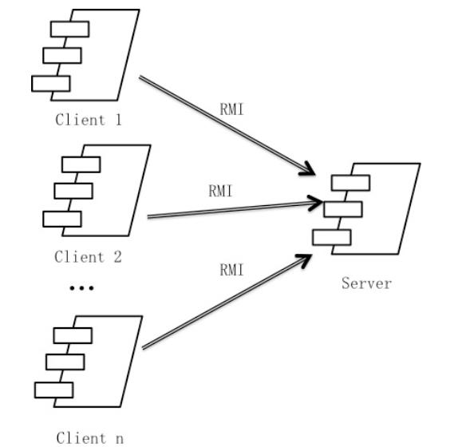
                
 图4.2 进程图
 
                 
                 
                 
&nbsp;&nbsp;&nbsp;&nbsp; 企业进存销系统中客户端构件是放在客户端机器上，服务器端构件是放在服务器端机器上。在客户端节点上，还要部署RMIStub构件。由于JavaRMI构件属于JDK6.0的一部分。所以，在系统JDK环境未设置好的情况下，需要将系统打包成exe文件。部署图如图4.3所示。 
 
 
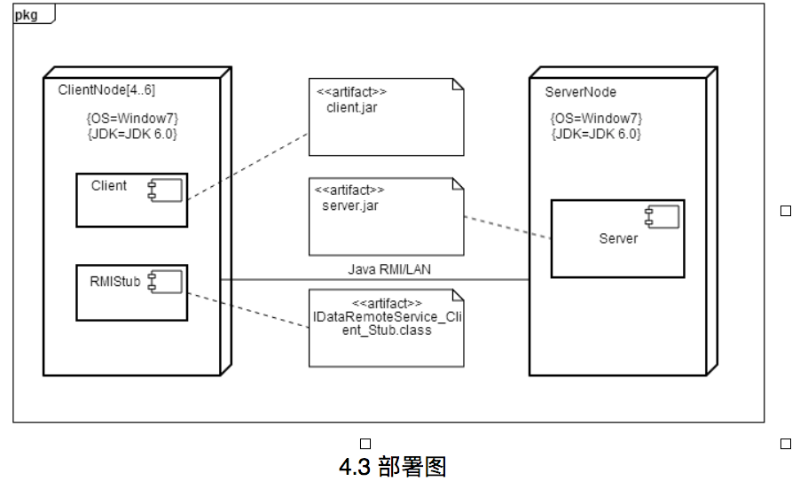
 
 
 
 
 
 
#5.接口视角
##5.1 模块的职责
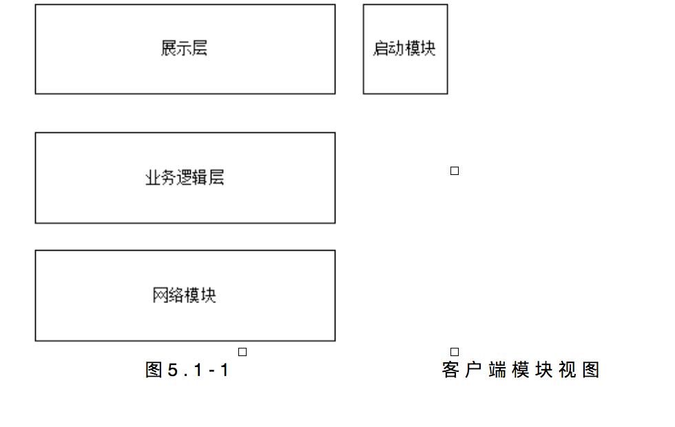
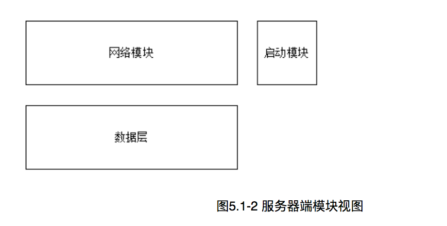
**表5.1-1 客户端各层的职责**

<table>
	<tr>
		<th>层</th>
		<th>职责</th>
	</tr>
<tr>
		<th>启动模块</th>
		<th>负责初始化网络通信机制，启动用户界面。</th>
	</tr>
<tr>
		<th>用户界面层</th>
		<th>基于窗口的进销存系统客户端用户界面。</th>
	</tr>
<tr>
		<th>业务逻辑层</th>
		<th>对于用户界面的输入响应和业务处理逻辑。</th>
	</tr>
<tr>
		<th>客户端网络模块</th>
		<th>利用Java RMI机制查找RMI服务</th>
	</tr>
</table>

 
<brqqq>
**表5.1-2 服务器端各层的职责**

<table>
	<tr>
		<th>层</th>
		<th>职责</th>
	</tr>
<tr>
		<th>启动模块</th>
		<th>负责初始化网络通信机制，启动用户界面。</th>
	</tr>
<tr>
		<th>数据层</th>
		<th>负责数据的持久化及数据访问接口。</th>
	</tr>
<tr>
		<th>服务器端网络模块</th>
		<th>利用Java RMI机制开启RMI服务，注册RMI服务</th>
	</tr>
</table>
&nbsp;&nbsp;&nbsp;&nbsp;每一层只是使用下方直接接触的层。层与层之间仅仅是通过接口的调用来完成的。层之间调用的接口如表5.1-3所示。
<table>
	<tr>
		<th>接口</th>
		<th>服务调用方</th>
		<th>服务提供方</th>
	</tr>
	<tr>
		<th align="left">classfyblservice 
		goodsblService 
		commodityblService 
		memberblService 
		stockblService 
		returnblService 
		bankblService 
		saleblService 
		collectblService 
		payblService 
		manageblservice 
		accountblservice 
		promotionblservice 
		checkblservice 
		userblservice</th>
		<th>客户端展示层</th>
		<th>客户端业务逻辑层</th>
	</tr>
<tr>
		<th align="left">goodsDataService 
		commodityDataService 
		memberDataService 
		stockDataService 
		returnDataService 
		bankDataService 
		saleDataService 
		collectDataService 
		payDataService 
		manageDataservice 
		accountDataservice 
		promotionDataservice 
		checkDataservice 
		userDataservice</th>
		<th>客户端业务逻辑层</th>
		<th>服务器端数据层</th>
	</tr>

</table>
&nbsp;&nbsp;&nbsp;&nbsp;借用用户管理用例来说明层之间的调用，如图5.1-3所示。每一层之间都是由上层依赖了一个接口（需接口），而下层实现这个接口（供接口）。userblService提供了User界面所需要的所有业务逻辑功能UserDataService提供了对数据库的增、删、改、查等操作。这样的实现就大大降低了层与层之间的耦合。

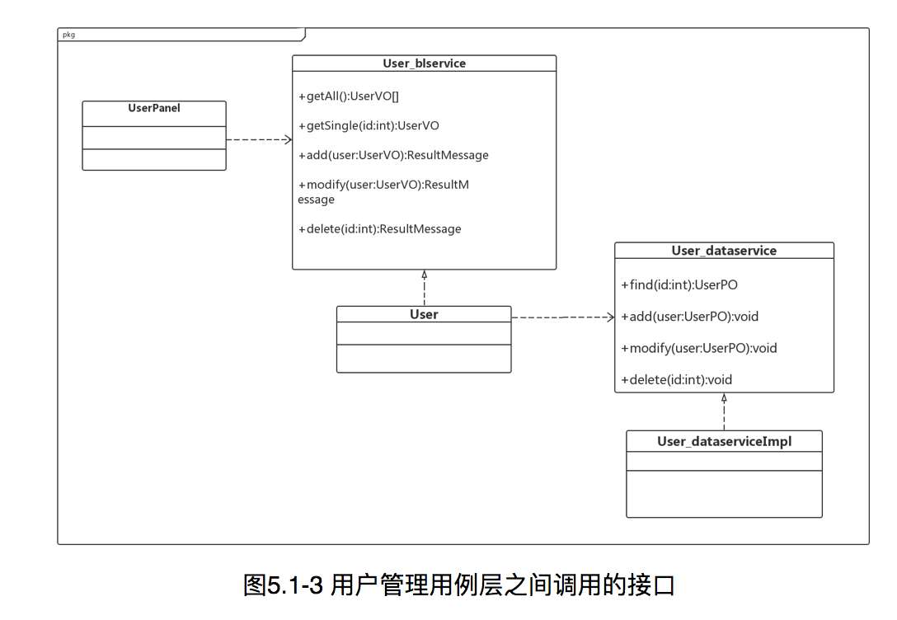
##5.2用户界面层的分解 
根据需求，系统存在19个用户界面：登录界面、 总经理主界面，销售策略界面、查看经营界面、财务人员主界面、收款界面、付款界面、初期建账界面、查看经营界面、库存管理人员界面、库存界面、商品管理界面、商品分类界面、进货销售人员主界面、销售界面、退货界面、进货界面、管理客户界面。
  界面跳转如图5.2.1所示。
 

#
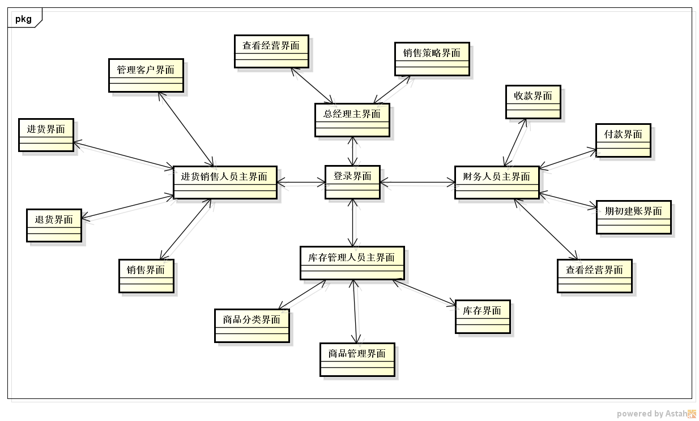
服务器端和客户端的用户界面设计接口是一致的，只是具体的页面不一样。用户界面类如图5.2.2所示。

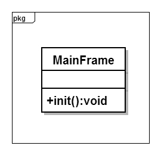
 
###5.2.1用户界面层的分解 
如表5.2.1-1所示为用户界面层模块的职责。 
表5.2.1-1 用户界面层模块的职责 
<table>

<tr><th>MainFrame</th>
<th colspan="2">界面Frame，负责界面的显示和界面的跳转。</th> </tr>
</table>

###5.2.2用户界面层模块的接口规范 
如表5.2.2所示为用户界面层模块的接口规范。 
表5.2.2 用户界面层模块的接口规范 
<table>
	<tr>
		<th colspan="3">提供的服务（供接口）</th>
	</tr>
	<tr>
		<th rowspan="3">mainui</th>
		<th>语法</th>
		<th>Init(args:String[])</th>
		</tr>
		<tr>
			<th>前置条件</th>
			<th>无</th>
		</tr>
		<tr>
			<th>后置条件</th>
			<th>显示Frame</th>	
		</tr>	
<tr>
		<th rowspan="3">orderui</th>
		<th>语法</th>
		<th>Init(args:String[])</th>
		</tr>
		<tr>
			<th>前置条件</th>
			<th>无</th>
		</tr>
		<tr>
			<th>后置条件</th>
			<th>显示OrderPanel</th>
</tr>	
<tr>
		<th rowspan="3">userui</th>
		<th>语法</th>
		<th>Init(args:String[])</th>
		</tr>
		<tr>
			<th>前置条件</th>
			<th>无</th>
		</tr>
		<tr>
			<th>后置条件</th>
			<th>显示UserPanel</th>
</tr>	
<tr>
		<th rowspan="3">promotionui</th>
		<th>语法</th>
		<th>Init(args:String[])</th>
		</tr>
		<tr>
			<th>前置条件</th>
			<th>无</th>
		</tr>
		<tr>
			<th>后置条件</th>
			<th>显示PromotionPanel</th>
</tr>	

<tr><th colspan="4">需要的服务（需接口)</th></tr>
<tr><th>服务名</th><th colspan="2">服务</th>
<tr><th>businessLogicService.orderblservice</th>
<th colspan="2">处理与订单查看、订单处理相关的接口</th> </tr>
<tr><th>businesslLogicService.user blservice</th>
<th colspan="2">处理用户信息的接口</th> </tr>
<tr><th>businessLogicService.promotionblservice
<th colspan="2">处理酒店、网站促销策略制定的接口</th> </th></tr>
<tr><th>businesslogicservice.hotelblservice</th>
<th colspan="2">处理酒店信息的接口</th> </tr>
</table>

###5.2.3 用户界面模块设计原理 
用户界面利用Java的JavaFx + css 来实现。

##5.3业务逻辑层的分解
&nbsp;&nbsp;&nbsp;&nbsp;业务逻辑层包括多个针对界面的业务逻辑处理对象。例如，User对象负责处理登陆界面的业务逻辑；User对象负责处理管理用户的业务逻辑。业务逻辑层的设计如图5.3-1所示。

###5.3.1业务逻辑层模块的职责
业务逻辑层模块的职责如表5.3.1-1所示
<table>
	<tr>
		<th>模块</th>
		<th>职责</th>
	</tr>
	<tr>
		<th align="left">classifybl</th>
		<th align="left">负责与商品分类相关的服务</th>
	</tr>
	<tr>
		<th align="left">goodsbl</th>
		<th align="left">负责与商品相关的服务</th>
	</tr>
	<tr>
		<th align="left">commoditybl</th>
		<th align="left">负责与库存相关的服务</th>
	</tr>
		<tr>
		<th align="left">memberbl</th>
		<th align="left">负责与会员相关的服务</th>
	</tr>
		<tr>
		<th align="left">stockbl</th>
		<th align="left">负责与进货相关的服务</th>
	</tr>
		<tr>
		<th align="left">returnbl</th>
		<th align="left">负责与退货相关的服务</th>
	</tr>
		<tr>
		<th align="left">bankbl</th>
		<th align="left">负责与银行账户相关的服务</th>
	</tr>
		<tr>
		<th align="left">salebl</th>
		<th align="left">负责与销售相关的服务</th>
	</tr>
		<tr>
		<th align="left">collectionbl</th>
		<th align="left">负责与收款相关的服务</th>
	</tr>
	<tr>
		<th align="left">paymentbl</th>
		<th align="left">负责与付款相关的服务</th>
	</tr>
	<tr>
		<th align="left">managebl</th>
		<th align="left">负责与查看经营相关的服务</th>
	</tr>
	<tr>
		<th align="left">accountbl</th>
		<th align="left">负责与账单相关的服务</th>
	</tr>
	<tr>
		<th align="left">promotionbl</th>
		<th align="left">负责与促销策略相关的服务</th>
	</tr>
	<tr>
		<th align="left">checkbl</th>
		<th align="left">负责与审批订单相关的服务</th>
	</tr>
	<tr>
		<th align="left">userbl</th>
		<th align="left">负责处理与用户信息管理相关的服务</th>
	</tr>
</table>

###5.3.1业务逻辑层模块的接口规范
表5.3.2-1 classifybl模块的接口规范
<table>
	<tr>
		<th colspan="3">提供的服务（供接口）</th>
	</tr>
	<tr>
		<th rowspan="3">classifybl.checkClassfiy</th>
		<th>语法</th>
		<th>public ArrayList&lt;ClassifyVO> checkClassify(String node);</th>
		</tr>
		<tr>
			<th>前置条件</th>
			<th>商品分类需更新</th>
		</tr>
		<tr>
			<th>后置条件</th>
			<th>返回最新的商品分类列表</th>		</tr>	
<tr>
		<th rowspan="3">classifybl.addClassify</th>
		<th>语法</th>
		<th> public ResultMessage addClassify(ClassifyVO vo);</th>
		</tr>
		<tr>
			<th>前置条件</th>
			<th>库存管理人员增加商品分类</th>
		</tr>
		<tr>
			<th>后置条件</th>
			<th>增加存储的商品分类</th>
</tr>	
<tr>
		<th rowspan="3">classifybl.deleteClassify</th>
		<th>语法</th>
		<th>   public ResultMessage deleteClassify(ClassifyVO vo);</th>
		</tr>
		<tr>
			<th>前置条件</th>
			<th>库存管理人员删除商品分类</th>
		</tr>
		<tr>
			<th>后置条件</th>
			<th>删除存储的商品分类</th>
</tr>	
<tr>
		<th rowspan="3">classifybl.updateClassify</th>
		<th>语法</th>
		<th>public ResultMessage updateClassify(ClassifyVO vo);</th>
		</tr>
		<tr>
			<th>前置条件</th>
			<th>库存管理人员修改商品分类</th>
		</tr>
		<tr>
			<th>后置条件</th>
			<th>改变存储的商品分类</th>
</tr>	
<tr>
		<th rowspan="3">classifybl.getGoods</th>
		<th>语法</th>
		<th>public ArrayList &lt;GoodsVO> getGoods(ClassifyVO vo);</th>
		</tr>
		<tr>
			<th>前置条件</th>
			<th>库存管理人员获取商品分类下的商品</th>
		</tr>
		<tr>
			<th>后置条件</th>
			<th>显示商品信息</th>
</tr>	

<tr><th colspan="4">需要的服务（需接口)</th></tr>
<tr><th>服务名</th><th colspan="2">服务</th>
<tr><th>ClassfiyData.add(ClassifyPO po);</th>
<th colspan="2">增加一个商品分类</th> </tr>
<tr><th>ClassfiyData.add(ClassifyPO parentPo, ClassifyPO sonPo);</th>
<th colspan="2">增加一个商品分类</th> </tr>
<tr><th>ClassfiyData.delete(ClassifyPO po);
<th colspan="2">删除一个商品分类</th> </th></tr>
<tr><th>ClassfiyData.update(ClassifyPO po);</th>
<th colspan="2">修改一个商品分类</th> </tr>
</table>

表5.3.2-2 goodsbl模块的接口规范
<table>
	<tr>
		<th colspan="3">提供的服务（供接口）</th>
	</tr>
	<tr>
		<th rowspan="3">goodsbl.addGoods</th>
		<th>语法</th>
		<th>public ResultMessage addGoods(GoodsVO vo);</th>
		</tr>
		<tr>
			<th>前置条件</th>
			<th>库存管理人员增加库存商品</th>
		</tr>
		<tr>
			<th>后置条件</th>
			<th>增加存储的商品</th>	
		</tr>	
<tr>
		<th rowspan="3">goodsbl.deleteGoods</th>
		<th>语法</th>
		<th>public ResultMessage deleteGoods(GoodsVO vo);</th>
		</tr>
		<tr>
			<th>前置条件</th>
			<th>库存管理人员删除商品</th>
		</tr>
		<tr>
			<th>后置条件</th>
			<th>删除存储的商品</th>
</tr>	
<tr>
		<th rowspan="3">goodsbl.updateGoods</th>
		<th>语法</th>
		<th>public ResultMessage updateGoods(GoodsVO vo);</th>
		</tr>
		<tr>
			<th>前置条件</th>
			<th>库存管理人员修改商品</th>
		</tr>
		<tr>
			<th>后置条件</th>
			<th>改变存储的商品信息</th>
</tr>	
<tr>
		<th rowspan="3">goodsbl.findGoods</th>
		<th>语法</th>
		<th>public ArrayList&lt;GoodsVO&gt;findGoods(String number, String name, String type);</th>
		</tr>
		<tr>
			<th>前置条件</th>
			<th>库存管理人员通过关键字(编号，名称，类型)查找商品修改商品</th>
		</tr>
		<tr>
			<th>后置条件</th>
			<th>显示商品信息列表</th>
</tr>	
<tr>
		<th rowspan="3">goodsbl.getGoods</th>
		<th>语法</th>
		<th>public ArrayList&lt;GoodsVO> getCurrentGoods();</th>
		</tr>
		<tr>
			<th>前置条件</th>
			<th>库存管理人员得到当天库存商品</th>
		</tr>
		<tr>
			<th>后置条件</th>
			<th>返回当天库存商品信息</th>
</tr>	

<tr><th colspan="4">需要的服务（需接口)</th></tr>
<tr><th>服务名</th><th colspan="2">服务</th>
<tr><th>GoodsData.add(GoodsPO po);</th>
<th colspan="2">增加一个商品</th> </tr>
<tr><th>GoodsData.find(String number, String name, String type);</th>
<th colspan="2">查找商品</th> </tr>
<tr><th>GoodsData.delete(GoodsPO po);
<th colspan="2">删除一个商品</th> </th></tr>
<tr><th>GoodsData.update(GoodsPO po);</th>
<th colspan="2">修改一个商品</th> </tr>
<tr><th>GoodsData.getCurrentGoods();</th>
<th colspan="2">得到当天库存商品</th> </tr>
</table>

表5.3.2-3 presentListbl模块的接口规范

<table>
	<tr>
		<th colspan="3">提供的服务（供接口）</th>
	</tr>
	<tr>
		<th rowspan="3">presentListbl.addPresentList</th>
		<th>语法</th>
		<th>  public ResultMessage addPresentList(PresentListVO vo);</th>
		</tr>
		<tr>
			<th>前置条件</th>
			<th>库存管理人员增加赠送单</th>
		</tr>
		<tr>
			<th>后置条件</th>
			<th>增加赠送单</th>	
		</tr>	
<tr>
		<th rowspan="3">presentListbl.deletePresentList</th>
		<th>语法</th>
		<th>public ResultMessage deletePresentList(PresentListVO vo)</th>
		</tr>
		<tr>
			<th>前置条件</th>
			<th>库存管理人员删除赠送单</th>
		</tr>
		<tr>
			<th>后置条件</th>
			<th>删除赠送单</th>
</tr>	
<tr>
		<th rowspan="3">presentListbl.update</th>
		<th>语法</th>
		<th>public ResultMessage update(PresentListVO vo)</th>
		</tr>
		<tr>
			<th>前置条件</th>
			<th>库存管理人员更新赠送单</th>
		</tr>
		<tr>
			<th>后置条件</th>
			<th>更新赠送单信息</th>
</tr>	
<tr>
<tr>
		<th rowspan="3">presentListbl.getPresentList</th>
		<th>语法</th>
		<th> public ArrayList<PresentListVO> getPresentList(String startTime, String endTime, String userName, String memberName)</th>
		</tr>
		<tr>
			<th>前置条件</th>
			<th>根据条件查找赠送单</th>
		</tr>
		<tr>
			<th>后置条件</th>
			<th>返回符合条件的赠送单列表</th>
</tr>	
<tr>
		<th rowspan="3">presentListbl.addPresentListRed</th>
		<th>语法</th>
		<th> public PresentListVO addPresentListRed(PresentListVO vo)</th>
		</tr>
		<tr>
			<th>前置条件</th>
			<th>财务人员生成赠送单红冲</th>
		</tr>
		<tr>
			<th>后置条件</th>
			<th>生成并保存红冲</th>
</tr>	
<tr>
		<th rowspan="3">presentListbl.getAllPresentList()</th>
		<th>语法</th>
		<th> public ArrayList<PresentListVO> getAllPresentList()</th>
	
		<tr>
			<th>前置条件</th>
			<th>得到所有赠送单</th>
		</tr>
		<tr>
			<th>后置条件</th>
			<th>显示所有赠送单</th>
</tr>	
</table>
<table>

<tr><th colspan="4">需要的服务（需接口)</th></tr>
<tr><th>服务名</th><th colspan="2">服务</th>
<tr><th> presentListData.add(PresentListPO po);</th>
<th colspan="2">增加赠送单</th> </tr>
<tr><th>presentListData.delete(PresentListPO po);</th>
<th colspan="2">删除赠送单</th> </tr>
<tr><th>presentListData.update(PresentListPO po);
<th colspan="2">更新赠送单</th> </th></tr>
<tr><th>presentListData.getPresentList(String startTime, String endTime, String userName, String memberName);</th>
<th colspan="2">查找得到赠送单</th> </th></tr>
<tr><th>presentListData.addRed(PresentListPO po)</th>
<th colspan="2">生成红冲</th> </tr>
<tr><th>presentListData.getAllList()</th>
<th colspan="2">得到所有礼品单</th> </tr>
</table>

表5.3.2-4 lackListbl模块的接口规范
<table>
	<tr>
		<th colspan="3">提供的服务（供接口）</th>
	</tr>
	<tr>
		<th rowspan="3">lackListbl.addlackList</th>
		<th>语法</th>
		<th>  public ResultMessage addlackList(lackListVO vo);</th>
		</tr>
		<tr>
			<th>前置条件</th>
			<th>库存管理人员增加报损单</th>
		</tr>
		<tr>
			<th>后置条件</th>
			<th>增加报损单</th>	
		</tr>	
<tr>
		<th rowspan="3">lackListbl.deletelackList</th>
		<th>语法</th>
		<th>public ResultMessage deletelackList(lackListVO vo)</th>
		</tr>
		<tr>
			<th>前置条件</th>
			<th>库存管理人员删除报损单</th>
		</tr>
		<tr>
			<th>后置条件</th>
			<th>删除报损单</th>
</tr>	
<tr>
		<th rowspan="3">lackListbl.update</th>
		<th>语法</th>
		<th>public ResultMessage update(lackListVO vo)</th>
		</tr>
		<tr>
			<th>前置条件</th>
			<th>库存管理人员更新报损单</th>
		</tr>
		<tr>
			<th>后置条件</th>
			<th>更新报损单信息</th>
</tr>	
<tr>
<tr>
		<th rowspan="3">lackListbl.getlackList</th>
		<th>语法</th>
		<th> public ArrayList<lackListVO> getlackList(String startTime, String endTime, String userName, String memberName)</th>
		</tr>
		<tr>
			<th>前置条件</th>
			<th>根据条件查找报损单</th>
		</tr>
		<tr>
			<th>后置条件</th>
			<th>返回符合条件的报损单列表</th>
</tr>	
<tr>
		<th rowspan="3">lackListbl.addlackListRed</th>
		<th>语法</th>
		<th> public lackListVO addlackListRed(lackListVO vo)</th>
		</tr>
		<tr>
			<th>前置条件</th>
			<th>财务人员生成报损单红冲</th>
		</tr>
		<tr>
			<th>后置条件</th>
			<th>生成并保存红冲</th>
</tr>	
<tr>
		<th rowspan="3">lackListbl.getAlllackList()</th>
		<th>语法</th>
		<th> public ArrayList<lackListVO> getAlllackList()</th>
	
		<tr>
			<th>前置条件</th>
			<th>得到所有报损单</th>
		</tr>
		<tr>
			<th>后置条件</th>
			<th>显示所有报损单</th>
</tr>	
</table>
<table>

<tr><th colspan="4">需要的服务（需接口)</th></tr>
<tr><th>服务名</th><th colspan="2">服务</th>
<tr><th> lackListData.add(lackListPO po);</th>
<th colspan="2">增加报损单</th> </tr>
<tr><th>lackListData.delete(lackListPO po);</th>
<th colspan="2">删除报损单</th> </tr>
<tr><th>lackListData.update(lackListPO po);
<th colspan="2">更新报损单</th> </th></tr>
<tr><th>lackListData.getlackList(String startTime, String endTime, String userName, String memberName);</th>
<th colspan="2">查找得到报损单</th> </th></tr>
<tr><th>lackListData.addRed(lackListPO po)</th>
<th colspan="2">生成红冲</th> </tr>
<tr><th>lackListData.getAllList()</th>
<th colspan="2">得到所有礼品单</th>
</tr>
</table>

表5.3.2-5 overflowListbl模块的接口规范
<table>
	<tr>
		<th colspan="3">提供的服务（供接口）</th>
	</tr>
	<tr>
		<th rowspan="3">overflowListbl.addoverflowList</th>
		<th>语法</th>
		<th>  public ResultMessage addoverflowList(overflowListVO vo);</th>
		</tr>
		<tr>
			<th>前置条件</th>
			<th>库存管理人员增加报溢单</th>
		</tr>
		<tr>
			<th>后置条件</th>
			<th>增加报溢单</th>	
		</tr>	
<tr>
		<th rowspan="3">overflowListbl.deleteoverflowList</th>
		<th>语法</th>
		<th>public ResultMessage delete overflowList(overflowListVO vo)</th>
		</tr>
		<tr>
			<th>前置条件</th>
			<th>库存管理人员删除报溢单</th>
		</tr>
		<tr>
			<th>后置条件</th>
			<th>删除报溢单</th>
</tr>	
<tr>
		<th rowspan="3">overflowListbl.update</th>
		<th>语法</th>
		<th>public ResultMessage update(overflowListVO vo)</th>
		</tr>
		<tr>
			<th>前置条件</th>
			<th>库存管理人员更新报溢单</th>
		</tr>
		<tr>
			<th>后置条件</th>
			<th>更新报溢单信息</th>
</tr>	
<tr>
<tr>
		<th rowspan="3">overflowListbl.getoverflowList</th>
		<th>语法</th>
		<th> public ArrayList<overflowListVO> getoverflowList(String startTime, String endTime, String userName, String memberName)</th>
		</tr>
		<tr>
			<th>前置条件</th>
			<th>根据条件查找报溢单</th>
		</tr>
		<tr>
			<th>后置条件</th>
			<th>返回符合条件的报溢单列表</th>
</tr>	
<tr>
		<th rowspan="3">overflowListbl.addoverflowListRed</th>
		<th>语法</th>
		<th> public overflowListVO addoverflowListRed(overflowListVO vo)</th>
		</tr>
		<tr>
			<th>前置条件</th>
			<th>财务人员生成报溢单红冲</th>
		</tr>
		<tr>
			<th>后置条件</th>
			<th>生成并保存红冲</th>
</tr>	
<tr>
		<th rowspan="3">overflowListbl.getAlloverflowList()</th>
		<th>语法</th>
		<th> public ArrayList<overflowListVO> getAlloverflowList()</th>
	
		<tr>
			<th>前置条件</th>
			<th>得到所有报溢单</th>
		</tr>
		<tr>
			<th>后置条件</th>
			<th>显示所有报溢单</th>
</tr>	
</table>
<table>

<tr><th colspan="4">需要的服务（需接口)</th></tr>
<tr><th>服务名</th><th colspan="2">服务</th>
<tr><th> overflowListData.add(overflowListPO po);</th>
<th colspan="2">增加报溢单</th> </tr>
<tr><th>overflowListData.delete(overflowListPO po);</th>
<th colspan="2">删除报溢单</th> </tr>
<tr><th>overflowListData.update(overflowListPO po);
<th colspan="2">更新报溢单</th> </th></tr>
<tr><th>overflowListData.getoverflowList(String startTime, String endTime, String userName, String memberName);</th>
<th colspan="2">查找得到报溢单</th> </th></tr>
<tr><th>overflowListData.addRed(overflowListPO po)</th>
<th colspan="2">生成红冲</th> </tr>
<tr><th>overflowListData.getAllList()</th>
<th colspan="2">得到所有礼品单</th> </tr>
</table>

###5.4.2数据层模块的接口规范
**表5.4.2-1 数据层classifydata模块的接口规范**
<table><tr><th colspan="3">提供的服务（供接口）</th>
	</tr>
		<th rowspan="3">ClassifyData.add</th>
		<th>语法</th>
		<th>public ResultMessage add(ClassifyPO po);</th>
		</tr><tr>
			<th>前置条件</th>
			<th>数据库不存在同样ID的分类</th>
		</tr>
		<tr>	<th>后置条件</th>
			<th>在数据库中增加一条记录，并且把序列化文件保存到本地</th>
</tr>	
tr>
		<th rowspan="3">ClassifyData.add</th>
		<th>语法</th>
		<th>public ResultMessage add(ClassifyPO parentPO, ClassifyPO sonPO);</th>
		</tr><tr>
			<th>前置条件</th>
			<th>数据库不存在同样ID的分类且添加的父分类下不存在商品</th>
		</tr>
		<tr>	<th>后置条件</th>
			<th>在数据库中增加一条记录，并且把序列化文件保存到本地</th>
</tr>	

<tr>
		<th rowspan="3">ClassifyData.delete</th>
		<th>语法</th>
		<th>public ResultMessage delete(ClassifyPO po);</th>
		</tr>
		<tr>
			<th>前置条件</th>
			<th>数据库存在此ID的分类</th>
		</tr>
		<tr>
			<th>后置条件</th>
			<th>在数据库中删除存储的商品分类，并且把序列化文件保存到本地</th>
</tr>	
<tr>
		<th rowspan="3">ClassifyData.update</th>
		<th>语法</th>
		<th>public ResultMessage update(ClassifyPO po);</th>
		</tr>
		<tr>
			<th>前置条件</th>
			<th>数据库存在此ID的分类</th>
		</tr>
		<tr>
			<th>后置条件</th>
			<th>在数据库中修改记录，并且把序列化文件保存到本地</th>
</tr>	
</table>

表5.3.2-2 GoodsData模块的接口规范
<table>
	<tr>
		<th colspan="3">提供的服务（供接口）</th>
	</tr>
	<tr>
		<th rowspan="3">GoodsData.add</th>
		<th>语法</th>
		<th>public ResultMessage add(GoodsPO po)</th>
		</tr>
		<tr>
			<th>前置条件</th>
			<th>数据库不存在同样ID的商品</th>
		</tr>
		<tr>
			<th>后置条件</th>
			<th>在数据库中增加一条记录，并且把序列化文件保存到本地</th>
		</tr>	
<tr>
		<th rowspan="3">GoodsData.delete</th>
		<th>语法</th>
		<th>public ResultMessage delete(GoodsPO po);</th>
		</tr><tr>
			<th>前置条件</th>
			<th>数据库存在此ID的商品</th>
		</tr>
		<tr>
			<th>后置条件</th>
			<th>在数据库中删除商品，并且把序列化文件保存到本地</th>
</tr>	
<tr>
		<th rowspan="3">GoodsData.update</th>
		<th>语法</th>
		<th>public ResultMessage update(GoodsPO po);</th>
		</tr>
		<tr>
			<th>前置条件</th>
			<th>数据库存在此ID的商品</th>
		</tr>
		<tr>
			<th>后置条件</th>
			<th>在数据库中修改商品，并且把序列化文件保存到本地</th>
</tr>	
<tr>
		<th rowspan="3">GoodsData.find</th>
		<th>语法</th>
		<th> public ArrayList&lt;GoodsPO>find(String number, String name, String type);</th>
		</tr>
		<tr>
			<th>前置条件</th>
			<th>数据库存在此关键字（编号唯一，名称和型号）的商品</th>
		</tr>
		<tr>
			<th>后置条件</th>
			<th>显示商品信息列表</th>
</tr>	
<tr>
		<th rowspan="3">GoodsData.getCurrentGoods</th>
		<th>语法</th>
		<th> public ArrayList<GoodsPO> getCurrentGoods();</th>
		</tr>
		<tr>
			<th>前置条件</th>
			<th>库存商品存在</th>
		</tr>
		<tr>
			<th>后置条件</th>
			<th>显示商品信息列表</th>
</tr>	

</table>

**表5.3.2-3 presentListData模块的接口规范**
<table>
	<tr>
		<th colspan="3">提供的服务（供接口）</th>
	</tr>
	<tr>
		<th rowspan="3">presentListData.add</th>
		<th>语法</th>
		<th> public ResultMessage add(PresentListPO po);</th>
		</tr>
		<tr>
			<th>前置条件</th>
			<th>增加赠送单</th>
		</tr>
		<tr>
			<th>后置条件</th>
			<th>数据库增加赠送单并保持序列化信息到本地</th>
		</tr>	
	
<tr>
		<th rowspan="3">presentListData.delete</th>
		<th>语法</th>
		<th>   public ResultMessage delete(PresentListPO po);</th>
		</tr>
		<tr>
			<th>前置条件</th>
			<th>删除赠送单</th>
		</tr>
		<tr>
			<th>后置条件</th>
			<th>数据库删除赠送单并保持序列化信息到本地</th>
</tr>	
<tr>
		<th rowspan="3">presentListData.update</th>
		<th>语法</th>
		<th>public ResultMessage update(PresentListPO po);</th>
		</tr>
		<tr>
			<th>前置条件</th>
			<th>更新赠送单</th>
		</tr>
		<tr>
			<th>后置条件</th>
			<th>数据库更新赠送单并保持序列化信息到本地</th>
</tr>	
<tr>
<tr>
		<th rowspan="3">presentListData.getPresentList</th>
		<th>语法</th>
		<th>  public ArrayList<PresentListPO> getPresentList(String startTime, String endTime, String userName, String memberName);</th>
		</tr>
		<tr>
			<th>前置条件</th>
			<th>数据库存在赠送单</th>
		</tr>
		<tr>
			<th>后置条件</th>
			<th>数据库给出符合条件的赠送单</th>
</tr>	
<tr>
		<th rowspan="3">presentListData.addRed</th>
		<th>语法</th>
		<th>public PresentListPO addRed(PresentListPO po)；</th>
		</tr>
		<tr>
			<th>前置条件</th>
			<th>数据库存在此赠送单</th>
		</tr>
		<tr>
			<th>后置条件</th>
			<th>数据库生成红冲并保存，并且把序列化文件保存到本地</th>
</tr>	
<tr>
		<th rowspan="3">presentListData.getAllList()</th>
		<th>语法</th>
		<th> public ArrayList<PresentListPO> getAllList();</th>
		</tr>
		<tr>
			<th>前置条件</th>
			<th>数据库存在赠送单</th>
		</tr>
		<tr>
			<th>后置条件</th>
			<th>数据库给出所有赠送单</th>
</tr>	

</table>

表5.3.2-4 lackListData模块的接口规范
<table>
	<tr>
		<th colspan="3">提供的服务（供接口）</th>
	</tr>
	<tr>
		<th rowspan="3">lackListData.add</th>
		<th>语法</th>
		<th> public ResultMessage add(lackListPO po);</th>
		</tr>
		<tr>
			<th>前置条件</th>
			<th>增加报损单</th>
		</tr>
		<tr>
			<th>后置条件</th>
			<th>数据库增加报损单并保持序列化信息到本地</th>
		</tr>	
	
<tr>
		<th rowspan="3">lackListData.delete</th>
		<th>语法</th>
		<th>   public ResultMessage delete(lackListPO po);</th>
		</tr>
		<tr>
			<th>前置条件</th>
			<th>删除报损单</th>
		</tr>
		<tr>
			<th>后置条件</th>
			<th>数据库删除报损单并保持序列化信息到本地</th>
</tr>	
<tr>
		<th rowspan="3">lackListData.update</th>
		<th>语法</th>
		<th>public ResultMessage update(lackListPO po);</th>
		</tr>
		<tr>
			<th>前置条件</th>
			<th>更新报损单</th>
		</tr>
		<tr>
			<th>后置条件</th>
			<th>数据库更新报损单并保持序列化信息到本地</th>
</tr>	
<tr>
<tr>
		<th rowspan="3">lackListData.getlackList</th>
		<th>语法</th>
		<th>  public ArrayList<lackListPO> getlackList(String startTime, String endTime, String userName, String memberName);</th>
		</tr>
		<tr>
			<th>前置条件</th>
			<th>数据库存在报损单</th>
		</tr>
		<tr>
			<th>后置条件</th>
			<th>数据库给出符合条件的报损单</th>
</tr>	
<tr>
		<th rowspan="3">lackListData.addRed</th>
		<th>语法</th>
		<th>public lackListPO addRed(lackListPO po)；</th>
		</tr>
		<tr>
			<th>前置条件</th>
			<th>数据库存在此报损单</th>
		</tr>
		<tr>
			<th>后置条件</th>
			<th>数据库生成红冲并保存，并且把序列化文件保存到本地</th>
</tr>	
<tr>
		<th rowspan="3">lackListData.getAllList()</th>
		<th>语法</th>
		<th> public ArrayList<lackListPO> getAllList();</th>
		</tr>
		<tr>
			<th>前置条件</th>
			<th>数据库存在报损单</th>
		</tr>
		<tr>
			<th>后置条件</th>
			<th>数据库给出所有报损单</th>
</tr>
</table>

表5.3.2-5 overflowListData模块的接口规范
<table>
	<tr>
		<th colspan="3">提供的服务（供接口）</th>
	</tr>
	<tr>
		<th rowspan="3">overflowListData.add</th>
		<th>语法</th>
		<th> public ResultMessage add(overflowListPO po);</th>
		</tr>
		<tr>
			<th>前置条件</th>
			<th>增加报溢单</th>
		</tr>
		<tr>
			<th>后置条件</th>
			<th>数据库增加报溢单并保持序列化信息到本地</th>
		</tr>	
	
<tr>
		<th rowspan="3">overflowListData.delete</th>
		<th>语法</th>
		<th>   public ResultMessage delete(overflowListPO po);</th>
		</tr>
		<tr>
			<th>前置条件</th>
			<th>删除报溢单</th>
		</tr>
		<tr>
			<th>后置条件</th>
			<th>数据库删除报溢单并保持序列化信息到本地</th>
</tr>	
<tr>
		<th rowspan="3">overflowListData.update</th>
		<th>语法</th>
		<th>public ResultMessage update(overflowListPO po);</th>
		</tr>
		<tr>
			<th>前置条件</th>
			<th>更新报溢单</th>
		</tr>
		<tr>
			<th>后置条件</th>
			<th>数据库更新报溢单并保持序列化信息到本地</th>
</tr>	
<tr>
<tr>
		<th rowspan="3">overflowListData.getoverflowList</th>
		<th>语法</th>
		<th>  public ArrayList<overflowListPO> getoverflowList(String startTime, String endTime, String userName, String memberName);</th>
		</tr>
		<tr>
			<th>前置条件</th>
			<th>数据库存在报溢单</th>
		</tr>
		<tr>
			<th>后置条件</th>
			<th>数据库给出符合条件的报溢单</th>
</tr>	
<tr>
		<th rowspan="3">overflowListData.addRed</th>
		<th>语法</th>
		<th>public overflowListPO addRed(overflowListPO po)；</th>
		</tr>
		<tr>
			<th>前置条件</th>
			<th>数据库存在此报溢单</th>
		</tr>
		<tr>
			<th>后置条件</th>
			<th>数据库生成红冲并保存，并且把序列化文件保存到本地</th>
</tr>	
<tr>
		<th rowspan="3">overflowListData.getAllList()</th>
		<th>语法</th>
		<th> public ArrayList<overflowListPO> getAllList();</th>
		</tr>
		<tr>
			<th>前置条件</th>
			<th>数据库存在报溢单</th>
		</tr>
		<tr>
			<th>后置条件</th>
			<th>数据库给出所有报溢单</th>
</tr>	
</table>

#6、信息视角 
##6.1 数据持久化对象 
系统的PO类就是对应的相关的实体类，在此只做简单的介绍，持久化序列化文件保存在po包中,如表6.1所示： 
表6.1 

<table>
<tr><th colspan="4">需要的服务（需接口)</th></tr>
<tr><th>类名</th><th colspan="2">包含的属性</th>
<tr><th>AccountPO</th>
<th colspan="2"> 账单信息：商品列表，账户列表，客户信息列表</th> </tr>
<tr><th>BankPO</th>
<th colspan="2">银行账户信息：用户名、账户余额</th> </tr>
<tr><th>ClassifyPO;
<th colspan="2">商品信息：商品名，商品编号</th> </th></tr>
<tr><th>CollectPO;
<th colspan="2">收款单：编号，供应商，零售商，操作员，收入列表（银行账户，余额，备注），总额</th> </th></tr>
<tr><th>CommodityPO;
<th colspan="2">库存信息：预设时间，日期，出库数量，出库金额，入库数量，入库金额，进货数量，进货金额，销售数量，销售金额</th> </th></tr>
<tr><th>GoodsPO;
<th colspan="2">商品信息：编号，名字，种类，库存数量，进价，零售价，即时进价，即时零售价</th> </th></tr>
<tr><th>MemberPO;
<th colspan="2">客户信息：编号，姓名，分类（进货商、销售商），电话，地址，邮编，电子邮箱，应收额度，应收，应付，默认业务员</th> </th></tr>
<tr><th> PayPO;
<th colspan="2">付款单信息：编号，操作员，账户，商品列表（名字，价格，备注），总额</th> </th></tr>
<tr><th> ReturnPO;
<th colspan="2">退款单信息：编号，操作员，仓库，价格，商品列表（名字，价格，备注），总额，库存信息</th> </th></tr>
<tr><th> SalePO;
<th colspan="2">销售单信息：编号，零售商，销售员，操作员，仓库，价格，商品列表（名字，价格，备注），总额，折扣，库存信息，备注</th> </th></tr>
<tr><th> StockPO;
<th colspan="2">进货单信息：编号，操作员，仓库，价格，单据（名字，价格，备注），总额，库存信息，备注</th> </th></tr>
</table>

持久化用户对象如GoodsPO的定义如图6.1，更多定义见原型代码 
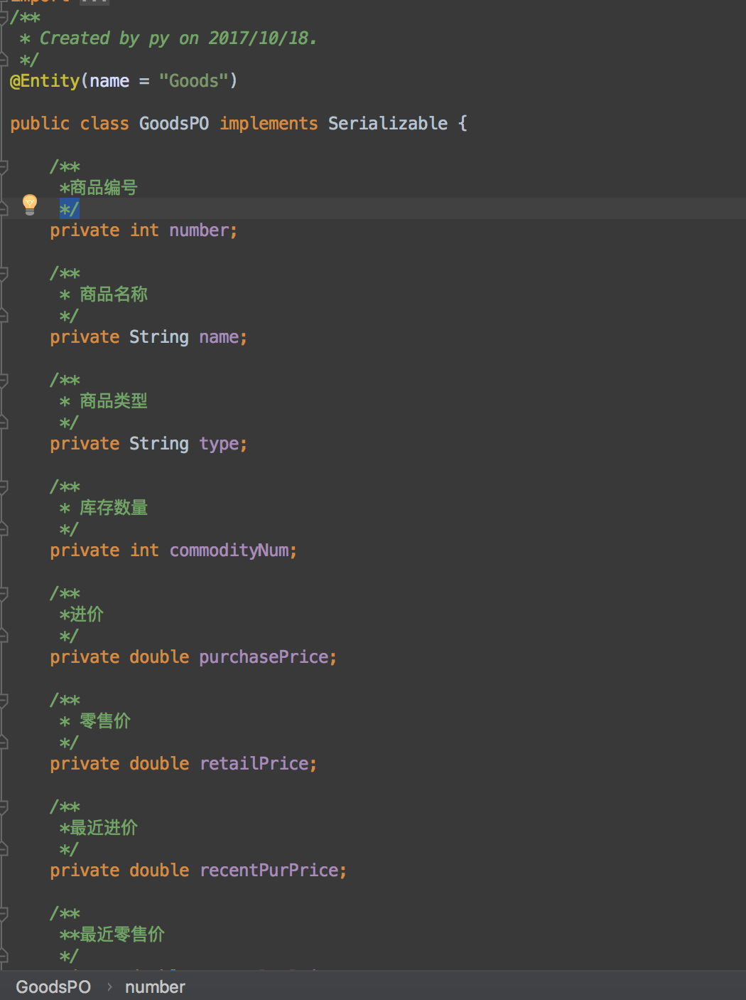
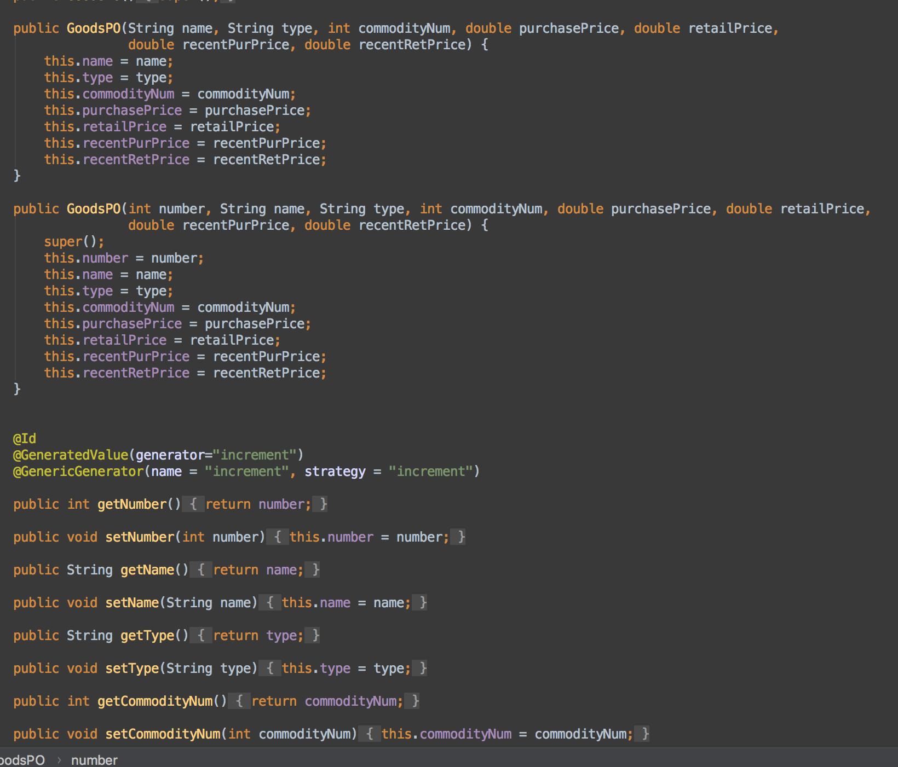