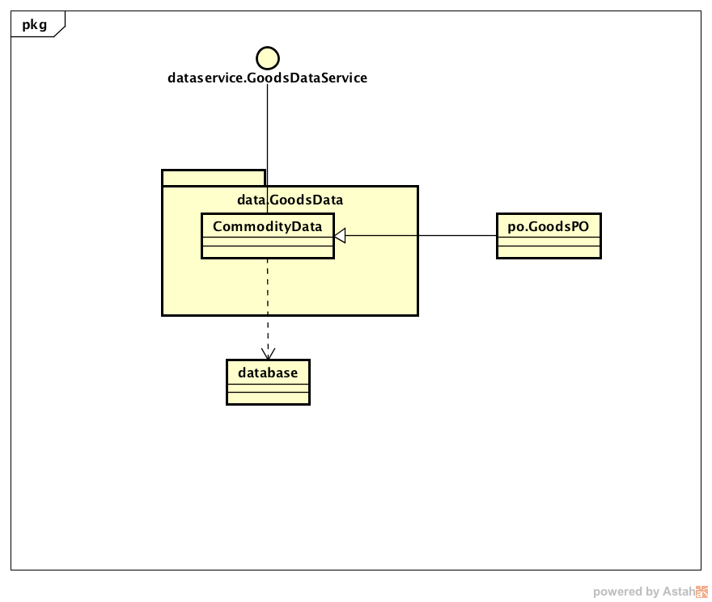
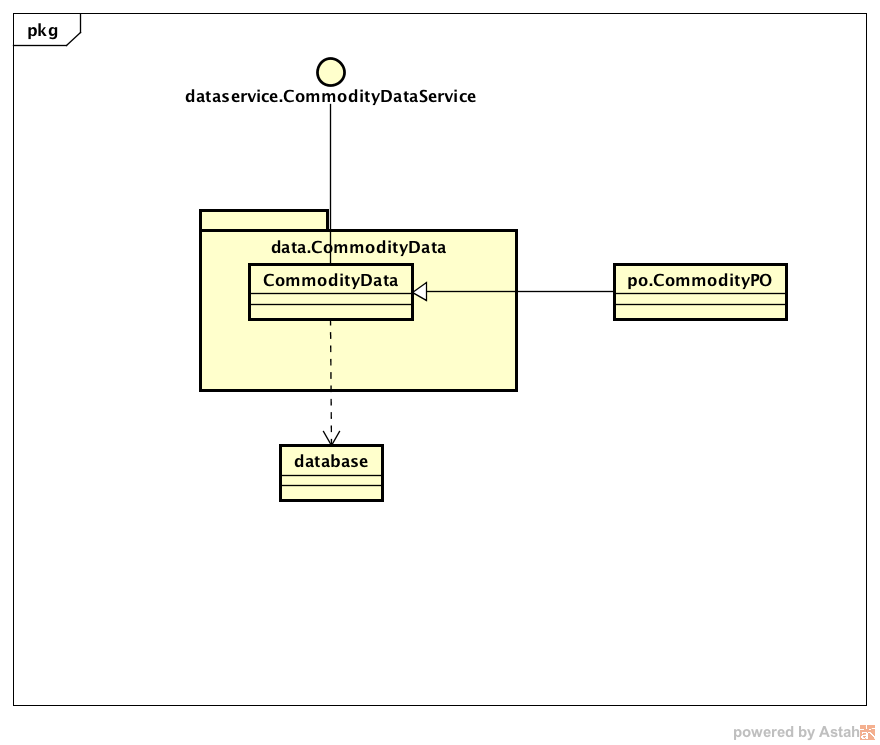

#4.2数据层的
##4.2.1ClassifyData模块
（1）模块概述
 ClassifyData模块承担的需求参见需求规格说明文档功能需求及相关功能需求。
ClassifyData模块的职责及接口参见软件体系结构描述文档。
（2）整体结构
根据体系结构的设计，采用分层风格，将系统分为展示层，业务逻辑层，数据层。每一层之间为了灵活性，添加了接口，以实现针对接口编程，隔离数据传输的职责，降低层与层之间耦合，添加的接口是ClassifyDataService 接口。ClassifyPO是做为管理信息的持久化对象被添加到设计模型中的。
ClassifyData模块的设计如图4.2.1-1所示. 

 
 
<table>
	<tr>
		<th>类</th>
		<th>职责</th>
	</tr>
	<tr>
		<th>ClassifyData</th>
		<th>商品分类数据层的对象模型，拥有增加商品分类，寻找所有异常的分类，删除分类，修改分类，查找分类的信息，支持模糊化查找。</th>
	</tr>
	</table>
	<table>
	
<tr>
		<th rowspan="3">ClassifyData.add</th>
		<th>语法</th>
		<th>public ResultMessage add(ClassifyPO po);</th>
		</tr><tr>
			<th>前置条件</th>
			<th>数据库不存在同样ID的分类</th>
		</tr>
		<tr>	<th>后置条件</th>
			<th>在数据库中增加一条记录，并且把序列化文件保存到本地</th>
</tr>	
<tr>
		<th rowspan="3">ClassifyData.exceptionFind </th>
		<th>语法</th>
		<th>public ArrayList&lt;ClassifyPO> exceptionFind ();</th>
		</tr>
		<tr>
			<th>前置条件</th>
			<th>无</th>
		</tr>
		<tr>
			<th>后置条件</th>
			<th>无</th>
</tr>	
<tr>
		<th rowspan="3">ClassifyData.delete</th>
		<th>语法</th>
		<th>public ResultMessage delete(ClassifyPO po);</th>
		</tr>
		<tr>
			<th>前置条件</th>
			<th>数据库存在此ID的分类</th>
		</tr>
		<tr>
			<th>后置条件</th>
			<th>在数据库中删除存储的商品分类，并且把序列化文件保存到本地</th>
</tr>	
<tr>
		<th rowspan="3">ClassifyData.modify</th>
		<th>语法</th>
		<th>public ResultMessage modify(ClassifyPO po);</th>
		</tr>
		<tr>
			<th>前置条件</th>
			<th>数据库存在此ID的分类</th>
		</tr>
		<tr>
			<th>后置条件</th>
			<th>在数据库中修改记录，并且把序列化文件保存到本地</th>
</tr>	
<tr>
		<th rowspan="3">ClassifyData.find</th>
		<th>语法</th>
		<th>public ArrayList&lt;ClassifyPO> find(String keywords);</th>
		</tr>
		<tr>
			<th>前置条件</th>
			<th>数据库存在相同用户名的商品分类</th>
		</tr>
		<tr>
			<th>后置条件</th>
			<th>根据用户名返回商品分类列表</th>
</tr>	
</table>
 
 
 
##4.2.2GoodsData模块
(1）模块概述
GoodsData模块承担的需求参见需求规格说明文档功能需求及相关功能需求。
GoodsData模块的职责及接口参见软件体系结构描述文档。
 （2）整体结构
根据体系结构的设计，采用分层风格，将系统分为展示层，业务逻辑层，数据层。每一层之间为了灵活性，添加了接口，以实现针对接口编程，隔离数据传输的职责，降低层与层之间耦合，添加的接口是GoodsDataService 接口。GoodsPO是做为管理信息的持久化对象被添加到设计模型中的。
GoodsData模块的设计如图4.2.1-2所示. 

 
 
 
<table>
	<tr>
		<th>类</th>
		<th>职责</th>
	</tr>
	<tr>
		<th>GoodsData</th>
		<th>商品数据层的对象模型，拥有增加商品，删除商品，修改商品信息，查找商品的信息，支持模糊化查找。</th>
	</tr>
	</table>
<table>
	<tr>
		<th colspan="3">提供的服务（供接口）</th>
	</tr>
	<tr>
		<th rowspan="3">GoodsData.add</th>
		<th>语法</th>
		<th>public ResultMessage add(GoodsPO po)</th>
		</tr>
		<tr>
			<th>前置条件</th>
			<th>数据库不存在同样ID的商品</th>
		</tr>
		<tr>
			<th>后置条件</th>
			<th>在数据库中增加一条记录，并且把序列化文件保存到本地</th>
		</tr>	
		<tr>
		<th rowspan="3">GoodsData.exceptionFind </th>
		<th>语法</th>
		<th>public ArrayList&lt;GoodsPO> exceptionFind ();</th>
		</tr>
		<tr>
			<th>前置条件</th>
			<th>无</th>
		</tr>
		<tr>
			<th>后置条件</th>
			<th>无</th>
</tr>	

<tr>
		<th rowspan="3">GoodsData.delete</th>
		<th>语法</th>
		<th>public ResultMessage delete(GoodsPO po);</th>
		</tr><tr>
			<th>前置条件</th>
			<th>数据库存在此ID的商品</th>
		</tr>
		<tr>
			<th>后置条件</th>
			<th>在数据库中删除商品，并且把序列化文件保存到本地</th>
</tr>	
<tr>
		<th rowspan="3">GoodsData.modify</th>
		<th>语法</th>
		<th>public ResultMessage modify(GoodsPO po);</th>
		</tr>
		<tr>
			<th>前置条件</th>
			<th>数据库存在此ID的商品</th>
		</tr>
		<tr>
			<th>后置条件</th>
			<th>在数据库中修改商品，并且把序列化文件保存到本地</th>
</tr>	
<tr>
		<th rowspan="3">GoodsData.find</th>
		<th>语法</th>
		<th> public ArrayList&lt;GoodsPO>find(String keywords);</th>
		</tr>
		<tr>
			<th>前置条件</th>
			<th>数据库存在此关键字的商品</th>
		</tr>
		<tr>
			<th>后置条件</th>
			<th>显示商品信息列表</th>
</tr>	
</table>

 
 
 

##4.2.3CommodityData模块
(1）模块概述
CommodityData模块承担的需求参见需求规格说明文档功能需求及相关功能需求。
CommodityData模块的职责及接口参见软件体系结构描述文档。
 （2）整体结构
根据体系结构的设计，采用分层风格，将系统分为展示层，业务逻辑层，数据层。每一层之间为了灵活性，添加了接口，以实现针对接口编程，隔离数据传输的职责，降低层与层之间耦合，添加的接口是CommodityDataService 接口。GoodsPO是做为管理信息的持久化对象被添加到设计模型中的。
CommodityData模块的设计如图4.2.1-3所示. 

 
 
 
<table>
	<tr>
		<th>类</th>
		<th>职责</th>
	</tr>
	<tr>
		<th>CommodityData</th>
		<th>库存数据层的对象模型，拥有判断库存时间，得到当前库存信息，得到库存商品明细，创建商品赠送单并储存记录，提交商品赠送单，减少库存数量并存储，提交报损单，提交报溢单，提交报溢单并存储记录的功能。</th>
	</tr>
	</table>
 
 
 
<table>
	<tr>
		<th colspan="3">提供的服务（供接口）</th>
	</tr>
	<tr>
		<th rowspan="3">CommodityData.isInTime</th>
		<th>语法</th>
		<th>public ResultMessage isInTime(String time);</th>
		</tr>
		<tr>
			<th>前置条件</th>
			<th>数据库中存在预设时间</th>
		</tr>
		<tr>
			<th>后置条件</th>
			<th>根据时间允许查看库存</th>	
		</tr>	
		<tr>
		<th rowspan="3">CommodityData.exceptionInTime</th>
		<th>语法</th>
		<th>public ArrayList<ClassifyPO> exceptionInTime();</th>
		</tr>
		<tr>
			<th>前置条件</th>
			<th>无</th>
		</tr>
		<tr>
			<th>后置条件</th>
			<th>无</th>	
		</tr>	
<tr>
		<th rowspan="3">CommodityData.getComInfo</th>
		<th>语法</th>
		<th>public  ArrayList&lt;commodityPO> getComInfo(String date);</th>
		</tr>
		<tr>
			<th>前置条件</th>
			<th>存在此日期的库存信息</th>
		</tr>
		<tr>
			<th>后置条件</th>
			<th>返回库存属性列表</th>
</tr>	
<tr>
		<th rowspan="3">CommodityData.checkCom</th>
		<th>语法</th>
		<th>public  ArrayList&lt;commodityPO> getGoods(String goodsNode)</th>
		</tr>
		<tr>
			<th>前置条件</th>
			<th>存在此日期的库存商品信息</th>
		</tr>
		<tr>
			<th>后置条件</th>
			<th>返回库存商品列表</th>
</tr>	
<tr>
<tr>
		<th rowspan="3">CommodityData.createPresentList</th>
		<th>语法</th>
		<th>public ArrayList&lt;commodityPO> createPresentList(String date);</th>
		</tr>
		<tr>
			<th>前置条件</th>
			<th>数据库存在被赠送商品</th>
		</tr>
		<tr>
			<th>后置条件</th>
			<th>数据库保存赠送单，并且把序列化文件保存到本地</th>
</tr>	
<tr>
		<th rowspan="3">CommodityData.submitPresentList</th>
		<th>语法</th>
		<th>public  boolean submitPresentOrder(String date, ArrayList&lt;commodityPO> presentLst);</th>
		</tr>
		<tr>
			<th>前置条件</th>
			<th数据库提交赠送单</th>
		</tr>
		<tr>
			<th>后置条件</th>
			<th>数据库保存提交赠送单记录，并且把序列化文件保存到本地</th>
</tr>	
<tr>
		<th rowspan="3">CommodityData.removeCom</th>
		<th>语法</th>
		<th>public  boolean removeCom(String date, ArrayList&lt;commodityPO> presentLst);</th>
		</tr>
		<tr>
			<th>前置条件</th>
			<th>数据库存在被赠送商品</th>
		</tr>
		<tr>
			<th>后置条件</th>
			<th>数据库保存减少记录，并且把序列化文件保存到本地</th>
</tr>	
<tr>
		<th rowspan="3">CommodityData.submitBreakageRecepit</th>
		<th>语法</th>
		<th>public  boolean submitBreakageRecepit(String date, ArrayList&lt;commodityPO> brkLst)</th>
		</tr>
		<tr>
			<th>前置条件</th>
			<th>数据库存在商品量且比实际少</th>
		</tr>
		<tr>
			<th>后置条件</th>
			<th>数据库保存库存报损单，并且把序列化文件保存到本地</th>
</tr>	
<tr>
		<th rowspan="3">CommodityData.submitOverflowRecepit</th>
		<th>语法</th>
		<th>public  boolean submitOverflowRecepit(String date, ArrayList&lt;commodityVO> overflowLst)</th>
		</tr>
		<tr>
			<th>前置条件</th>
			<th>数据库存在商品量且比实际多</th>
		</tr>
		<tr>
			<th>后置条件</th>
			<th>数据库保存库存报溢单，并且把序列化文件保存到本地</th>
</tr>	
<tr>
		<th rowspan="3">CommodityData.submitWarningRecepit</th>
		<th>语法</th>
		<th>public  boolean submitWarningRecepit(String date, ArrayList&lt;commodityPO> overflowLst)</th>
		</tr>
		<tr>
			<th>前置条件</th>
			<th>数据库预设警戒数量并且库存数量低于警戒数量</th>
		</tr>
		<tr>
			<th>后置条件</th>
			<th>数据库保存库存报警单，并且把序列化文件保存到本地，</th>
</tr>	

</table>

