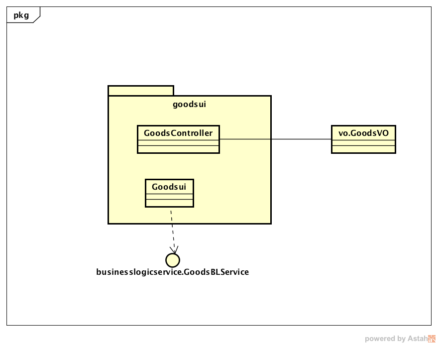
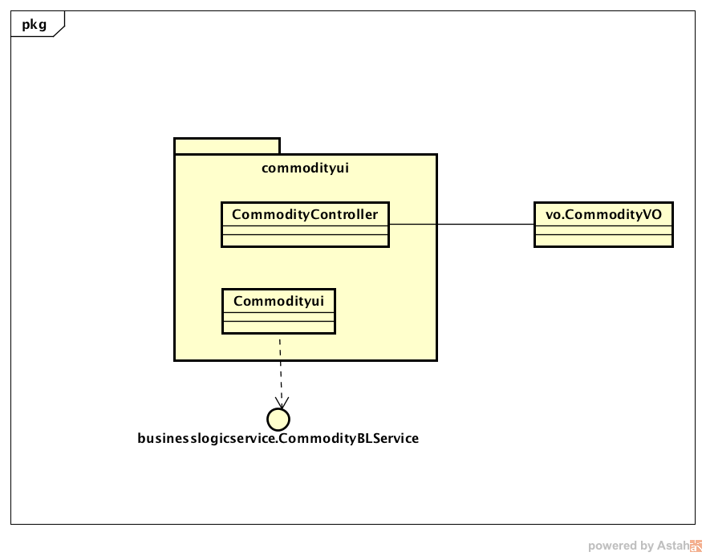

#4.3界面展示层的分解
   界面展示	层的开发包图参见软件体系结构说明文档图4.1
##4.3.1classifyui模块
（1）模块概述
 classifyui模块承担的需求参见需求规格说明文档功能需求及相关功能需求。
classifyui模块的职责及接口参见软件体系结构描述文档。 
（2）整体结构
为了隔离界面展示职责和逻辑控制职责，我们添加classifyuiController，这样classifyuiController 将会承担商品分类相关的界面跳转并且调用逻辑层classifybl、对象的逻辑方法。将classifyVO是做为管理传递和暂时持有的数据对象被添加到设计模型中的。
classifyui模块的设计如图4.3.1-1所示.

 
 
 
<table>
	<tr>
		<th>类</th>
		<th>职责</th>
	</tr>
	<tr>
		<th>ClassifyController</th>
		<th>负责实现调用逻辑层与商品分类有关的逻辑，并且实现界面间的跳转。</th>
	</tr>
	<tr>
		<th>Classifyui</th>
		<th>负责商品分类的界面显示</th>
	</tr>
	</table>
	表4.3.2-1 classifyui模块的各个类的职责

（2）模块内部类的接口规范
<table>
<tr><th colspan="4">需要的服务（需接口)</th></tr>
<tr><th>服务名</th><th colspan="2">服务</th>
<tr><th>ClassfiyController.addClassify(ClassifyPO po);</th>
<th colspan="2">增加一个商品分类</th> </tr>
<tr><th>ClassfiyController.findClassify(String keywords);</th>
<th colspan="2">查找一个商品分类，已知商品关键字</th> </tr>
<tr><th>ClassfiyController.deleteClassify(ClassifyPO po);
<th colspan="2">删除一个商品分类</th> </th></tr>
<tr><th>ClassfiyController.modifyClassify(ClassifyPO po);</th>
<th colspan="2">修改一个商品分类</th> </tr>
<tr><th>ClassfiyController.checkClassify(ClassifyPO po);</th>
<th colspan="2">查看一个商品分类</th> </tr>
</table>

##4.3.2goodsui模块
1）模块概述
 goodsui模块承担的需求参见需求规格说明文档功能需求及相关功能需求。
goodsui模块的职责及接口参见软件体系结构描述文档。 
（2）整体结构
为了隔离界面展示职责和逻辑控制职责，我们添加goodsuiController，这样goodsuiController 将会承担商品信息相关的界面跳转并且调用逻辑层goodsbl、对象的逻辑方法。将goodsVO是做为管理传递和暂时持有的数据对象被添加到设计模型中的。
goodsui模块的设计如图4.3.1-2所示.

 
 
 
<table>
	<tr>
		<th>类</th>
		<th>职责</th>
	</tr>
	<tr>
		<th>goodsController</th>
		<th>负责实现调用逻辑层与商品有关的逻辑，并且实现界面间的跳转。</th>
	</tr>
	<tr>
		<th>goodsui</th>
		<th>负责商品的界面显示</th>
	</tr>
	</table>
	表4.3.2-2 goodsui模块的各个类的职责

（2）模块内部类的接口规范
<table>
<tr><th colspan="4">需要的服务（需接口)</th></tr>
<tr><th>服务名</th><th colspan="2">服务</th>
<tr><th>GoodsController.addGoods(GoodsPO po);</th>
<th colspan="2">增加一个商品</th> </tr>
<tr><th>GoodsController.findGoods(String keywords);</th>
<th colspan="2">查找一个商品</th> </tr>
<tr><th>GoodsController.deleteGoods(GoodsPO po);
<th colspan="2">删除一个商品</th> </th></tr>
<tr><th>GoodsController.modifyGoods(GoodsPO po);</th>
<th colspan="2">修改一个商品</th> </tr>
<tr><th>GoodsController.findGoods(GoodsPO po);</th>
<th colspan="2">查询一个商品</th> </tr>
</table>

##4.3.2commodityui模块
1）模块概述
 commodityui模块承担的需求参见需求规格说明文档功能需求及相关功能需求。
commodityui模块的职责及接口参见软件体系结构描述文档。 
（2）整体结构
为了隔离界面展示职责和逻辑控制职责，我们添加commodityuiController，这样commodityuiController 将会承担库存相关的界面跳转并且调用逻辑层goodsbl、对象的逻辑方法。将commodityVO是做为管理传递和暂时持有的数据对象被添加到设计模型中的。
commodityui模块的设计如图4.3.1-2所示.

 
 
 
<table>
	<tr>
		<th>类</th>
		<th>职责</th>
	</tr>
	<tr>
		<th>commodityController</th>
		<th>负责实现调用逻辑层与库存有关的逻辑，并且实现界面间的跳转。</th>
	</tr>
	<tr>
		<th>commodityui</th>
		<th>负责库存的界面显示</th>
	</tr>
	</table>
	表4.3.2-2 goodsui模块的各个类的职责

（2）模块内部类的接口规范
<table>
<tr><th colspan="4">需要的服务（需接口)</th></tr>
<tr><th>服务名</th><th colspan="2">服务</th>
<tr><th> CommodityData.isInTime(String time);</th>
<th colspan="2">检查库存在预设时间内</th> </tr>
<tr><th>CommodityData.getComInfo(String date);</th>
<th colspan="2">查询库存</th> </tr>
<tr><th>CommodityData.getGoods(String goodsNode);
<th colspan="2">获得商品信息</th> </th></tr>
<tr><th>CommodityData.createPresentList(String date);</th>
<th colspan="2">创建赠送方案</th> </th></tr>
<tr><th>CommodityData.removeCom(String date, ArrayList&It;CommodityPO> lst)</th>
<th colspan="2">删除赠送商品</th> </tr>
<tr><th>CommodityData.submitBreakageRecepit	(String date, ArrayList&It;CommodityPO> lst)</th>
<th colspan="2">提交报损单</th> </tr>
<tr><th>CommodityData.submitOverflowRecepit	(String date, ArrayList&It;CommodityPO> lst)</th>
<th colspan="2">提交报溢单</th> </tr>
<tr><th>CommodityData.submitWarningRecepit(String date, ArrayList&It;CommodityPO> lst)</th>
<th colspan="2">提交报警单</th> </tr>

</table>
