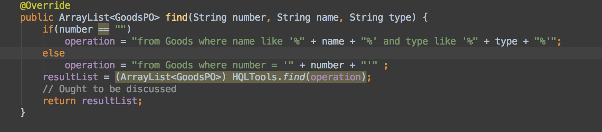
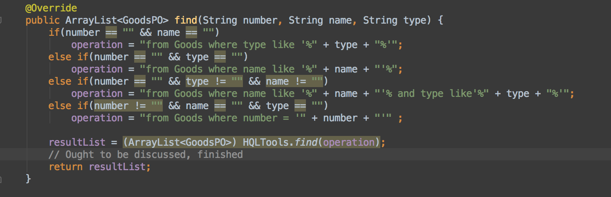
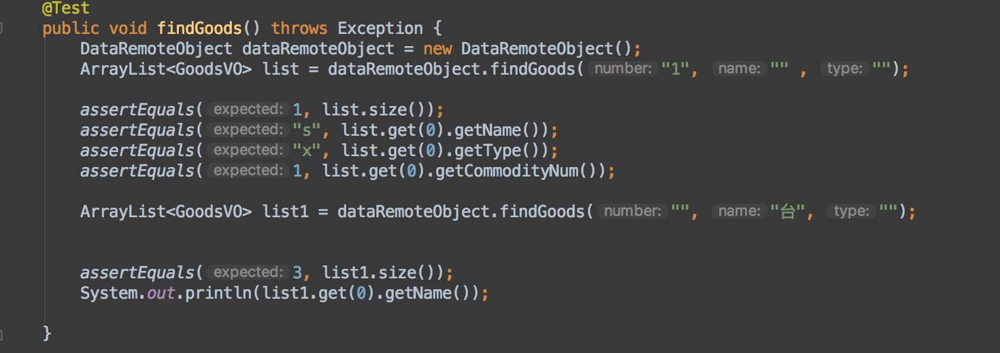
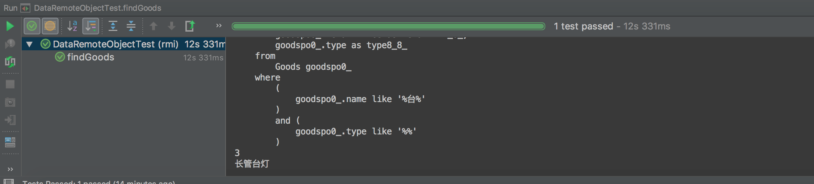

#
ERPNJU 系统测试汇报

#1.引言
##1.1编写目的
软件测试计划是指导测试过程的纲领性文件，包含了产品概述，测试策略，测试方法，测试区域，测试配置，测试周期，测试资源，测试交流，风险分析等内容。借助软件测试计划，参与测试的项目成员，尤其是测试管理人员，可以明确测试任务和测试方法，保持测试实施过程的顺畅沟通，跟踪和控制测试进度，应对测试过程中的各种变更。

##1.2项目背景
本项目用于2017年南京大学软件工程大作业进销存系统(ERPNJU)，由16级软件工程专业第11组开发，用于学习目的、非商业，工程将在其后声明为MIT!

##1.3
定义A.软件环境 MAC OSX10, windows8, windows 10(配置Java环境)，Java编译，IDEA，sublime text3, XCode编辑。

B.硬件环境: 100M以太网，CPU2.0GHZ以上，512M以上内存，500M以上硬盘空间。
C. 项目用户及测试人员：使用windows和MAC OSX的学生个人用户，由项目开发小组中每位成员进行测试。

##1.4参考资料
参考资料：<ol>
<li>IEEE std 1471-2000</li>
<li>丁二玉，刘钦.计算与软件工程（卷二）[M]机械工业出版2012：134—182</li>
<li>Steve McConnell，代码大全2 电子工业出版社出版：2006 

#2.任务概述
##2.1目标
 对系统data层curd操作的测试，由潘羽完成
 前端完成对系统交互的测试
 
##2.2运行环境
A.软件环境 MAC OSX10, windows8, windows 10(配置Java环境和MySQL数据库)，Java编译，IDEA，sublime text3, XCode编辑。

B.硬件环境: 100M以太网，CPU2.0GHZ以上，512M以上内存，500M以上硬盘空间。

##2.3需求概述
对十一个核心功能和部分提及非核心功能进行测试（包括导出Excel表格，查看日志等）

##2.4条件与限制
数据库在进行测试时，未全部以大量数据进行测试，部分测试用例属于一次性测试用例，不可使用第二次。（如增加，删除操作）

#3.计划
##3.1测试方案
进行系统测试时，核心功能点稳定性和可用性。
查询测试功能的传输速度和正确性。
更新，测试其稳定性和可行性。

##3.2测试项目
具体见需求说明文档（覆盖所有核心非核心功能点）

##3.3测试准备
MAC OSX10 系统， Windows10系统，个人PC机各一台（配有Java环境，MySQL数据库和ide）

##3.4测试机构及人员
机构名称:由软工第11组进行测试.
负责人: 潘羽
职责: 进行和监督测试工作正常进行

#4.测试项目说明
##4.1测试项目名称及测试内容
涵盖包括十一个核心功能点的data层测试，对于工具类的测试，非核心功能点的交互测试
##4.2测试用例
包含测试类：GoodsDataServiceImplTest等data层测试用例和前端交互展示的测试
后端测试用例均为测试驱动开发类型的黑盒测试，不考虑具体实现，允许极少规模的效率低下的代码。在ide里面跑过测试用例即可（如非第一次，请注释掉所有增删代码或者清空本地数据库数据），在通过所有测试用例显示绿色即可。
前端交互测试确保显示正常，**关注用户体验。

##4.3进度
已完成测试

##4.4测试资料
http://junit.sourceforge.net官方文档

#5.评价
##5.1范围
由于开发学习需要，并未直接通过宿主机共享数据库，在扩展开发项目时即可调整，开发阶段以本地数据库调试便捷。RMI下Hibernate速度基本达到要求。

##5.2准则
 如果上述功能能够在合理环境下正常使用。
 能够找出在极端情况下不能正常使用的情况，则本次测试成功。
#6.对测试用例的详细说明
##6.1 单元测试对data层测试的说明（附图）
对dataservice包的底层数据测试做了详尽的测试，在初次测试中使用读写文件覆盖大范围数据方便实现批量增加，在新旧项目中使用覆盖全部功能测试，后期主要对curd中查找进行重点集中的测试（尤其是模糊查找），对辅助类方法也进行了测试。在测试过程中，对ResultMessage（自建的等价于布尔类型的enum）的通过与否与测试用例执行次数有关，如第一次增加商品1，返回ResultMessage.Success，第二次则返回ResultMessage.Fail，对测试会造成影响（但我更看重的是第一次的返回结果，重复直到成功通过测试用例停止测试，不再复用除非清空数据库）对curd操作如果明确删除添加失败，在辅助类HQLTools会有提示，hibernate log也会给予明确的反馈。大作业的三个项目均在我的GitHub上可以找到，<a href="https://github.com/Pypy233/Software-Engineering-Team-Work2/tree/master/src/test">旧版本的项目测试连接</a>，<a href="https://github.com/Pypy233/ERPServer/tree/master/src/test/java">新的项目ERPServer项目</a>
##6.2对测试过程出现问题的说明
下面贴出来的增加遇到的查找的问题，具体需求的对商品实现模糊查找，但在测试过程中发现对类型并没有能够正确反馈，经过单步调试以后发现data层有误，对查询条件在未填写时候并没有考虑。贴出错误代码
修正后代码
跑测试的测试代码
控制台信息

##6.3对计算公式的说明
项目中一些复杂的计算，在测试过程中使用的公式如下：

##6.4对集成测试的说明
在项目中，绝大多数的bl层均是直接调用data层服务，所以基本都是对data层测试，原本使用的集成测试是travis，但是build过程中对hibernate框架配置出现问题，我做的test能通过（玄学?）,在刘钦老师建议下直接桩，controller，主要由前端完成，老版本的桩和controller由前端调用，在老版本项目可见。

##6.5对warning的说明
项目中出现的绝大多数warning是空指针，在集成时一一解决，主要是ArrayList的初始化问题。报出log4j:WARN No appenders could be found for logger (org.jboss.logging).
log4j:WARN Please initialize the log4j system properly.的警告是并未配置log4j的配置文件，我个人倾向于在假期把它改成一个web项目，所以没有修改框架。

